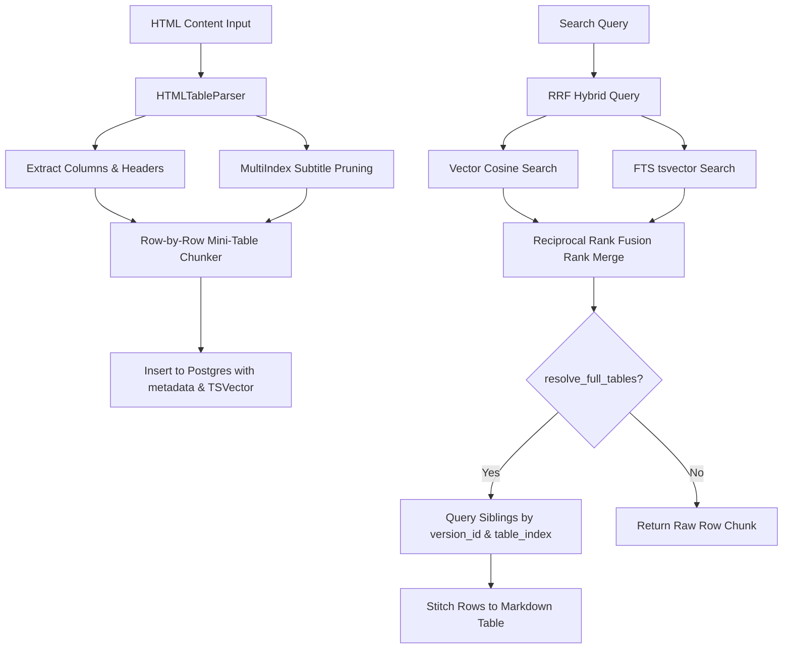

# ADR-005: RRF Hybrid Search & Parent Table Sibling Reconstruction

## Context & Problem Statement

Standard RAG (Retrieval-Augmented Generation) systems suffer from two major retrieval limitations when dealing with financial/banking documents (e.g. interest rate pages, FD rates):
1. **Embedding Dilution on Tables:** Ingesting large HTML tables as single plain-text blocks dilutes the semantic density of individual rows. Conversely, chunking tables blindly splits rows into fragmented pieces that lose table header headers/context.
2. **Dense-only Retrieval Limitations:** Plain vector searches often fail to retrieve specific keyword matching terms (e.g., specific rate percentages "6.75%" or exact tenures "10 months"). A hybrid search utilizing both dense embeddings and keyword matching is required.

We needed a system that:
* Indexes chunks using both dense vectors and database-native Full-Text Search (FTS).
* Merges search ranks using Reciprocal Rank Fusion (RRF).
* Chunks HTML tables at row granularity while retaining hierarchical column structures.
* Reconstructs/stitches the full parent table dynamically when requested by the chatbot.

---

## Proposed Decisions & Architecture



### 1. Token-Aware Row-Level Table Chunking
* **Component Built:** `HTMLTableParser` inside [parser.py](file:///c:/Users/akliv/Desktop/AkeshPersonal/ChatBot/app/ingest/parser.py) and `TokenAwareChunker` inside [chunker.py](file:///c:/Users/akliv/Desktop/AkeshPersonal/ChatBot/app/ingest/chunker.py).
* **Approach:** 
  * Parses tables using Beautiful Soup and Pandas.
  * Prunes common redundant MultiIndex header prefixes to keep table subtitles clean (stored in `df.attrs["table_subtitle"]`).
  * Serializes each individual row as a self-contained mini-Markdown table with headers to preserve structure.
  * Captures row metadata: `type="table_row"`, `table_index`, `row_index`, and `table_title`.

### 2. Native PostgreSQL Hybrid Search (RRF)
* **Component Built:** `PGVectorStore.query_similarity` in [pgvector.py](file:///c:/Users/akliv/Desktop/AkeshPersonal/ChatBot/app/vector_store/pgvector.py).
* **Approach:**
  * Added a `tsv_content` `tsvector` column and standard GIN index to `document_chunks`.
  * Added an `HNSW` vector index on the embedding vector column to optimize high-scale cosine operations.
  * Search retrieves top candidate chunks using parallel vector cosine similarity and full-text searches.
  * Ranks candidates using the Reciprocal Rank Fusion (RRF) formula:
    $$RRF(d) = \sum_{m \in M} \frac{1}{60 + r_m(d)}$$
  * Standardizes FTS and vector merges offline with an SQLite fallback query for tests.

### 3. Dynamic Parent Table Reconstruction
* **Component Built:** POST `/search` Router endpoint in [routes.py](file:///c:/Users/akliv/Desktop/AkeshPersonal/ChatBot/app/search/routes.py).
* **Approach:**
  * The search request accepts an optional `resolve_full_tables` boolean flag.
  * If enabled and the returned chunk is a `table_row`, it fetches all sibling row chunks matching the chunk's `version_id` and `table_index` from the database.
  * It extracts the headers and row snippets, reconstructing them into a single, fully-formed Markdown table block returned in the `content` field.

---

## Challenges & Solutions

### 1. SQLAlchemy Class-level `.metadata` Property Conflict
* **Problem:** In SQLAlchemy, every declarative database model class (inheriting from `Base`) automatically exposes a class-level `.metadata` descriptor pointing to the schema context. Attempting to name a database column `metadata` leads to exceptions:
  `Column expression, FROM clause, or other columns clause element expected, got MetaData()`
* **Solution:** We explicitly avoided naming the database column `metadata`. Instead, we introduced the column as `chunk_metadata` in [models.py](file:///c:/Users/akliv/Desktop/AkeshPersonal/ChatBot/app/ingest/models.py). The query layer parses and exposes it as the external dictionary key `"metadata"` so that external API contracts remain unchanged.

### 2. Database Schema Migrations on Startup
* **Problem:** Since we run our development stack in Docker containers with direct volume mounts, adding database columns requires matching database tables.
* **Solution:** Added dynamic migrations in `main.py` using `ALTER TABLE document_chunks ADD COLUMN IF NOT EXISTS chunk_metadata jsonb;` at runtime during lifespan startup.

### 3. API Ingestion Test HTML Parsing Forwarding
* **Problem:** The manual text ingestion endpoint `/ingest/text` previously assumed plain text inputs only (`is_html=False`), which prevented testing HTML elements from manual API tools.
* **Solution:** Added an optional `is_html` boolean field to `TextIngestRequest` schema and forwarded it to the ingestion service, allowing direct manual posting of raw HTML snippets for table parsing testing.

---

## Verification Plan

### Automated Test Coverage
We created comprehensive verification scripts inside [test_search.py](file:///c:/Users/akliv/Desktop/AkeshPersonal/ChatBot/tests/search/test_search.py):
* `test_table_reconstruction_and_sibling_resolutions`
  * Registers a user and ingests an HTML rate table snippet with `"is_html": true`.
  * Verifies normal query returns only the single matching row.
  * Verifies resolving query returns the reconstructed full table.
  * Verifies direct chunk ID query successfully stitches siblings.

Run command:
```bash
uv run pytest -v -m "not real_oci"
```
**Results:** All 30 tests passed successfully.
