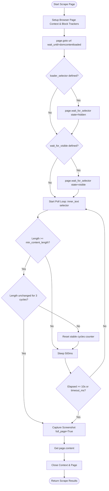

# Selector Configurations Guide

This guide explains how to manage page parsing rules, loading timeouts, and dynamic rendering selectors using [selectors.yaml](file:///c:/Users/akliv/Desktop/AkeshPersonal/ChatBot/app/crawl/selectors.yaml).

The `PlaywrightScraper` matches incoming URLs against this YAML configuration to determine selectors for loading overlay checks, container extraction, and stabilization criteria.

---

## 1. File Structure

The selector configuration is divided into two main sections:
1.  **`default`**: Configuration values applied to any URL that does not match a domain-specific override.
2.  **`domains`**: A list of overrides containing domain names and custom page structures.

### YAML Schema Definition

```yaml
default:
  content_selector: "body"          # CSS selector targeting the primary content container
  loader_selector: null             # CSS selector targeting the loading spinner/overlay
  min_content_length: 100           # Minimum expected characters in content container
  timeout_ms: 30000                 # Navigation and parsing timeout in milliseconds
  wait_for_visible: null            # CSS selector that must become visible before scraping

domains:
  - domain: "dcb.bank.in"           # The target domain host
    content_selector: "main.page-content"
    loader_selector: ".loader"
    min_content_length: 200
    timeout_ms: 45000
    wait_for_visible: "main.page-content"
```

---

## 2. Configuration Parameters

### `content_selector` (string, required)
- **Purpose**: Defines the CSS selector targeting the primary body content area of the web page.
- **Why it matters**: Tells the scraper which DOM elements contain target text content. Only text within this selector is extracted and saved to `text_content` (scripts, styles, and other metadata outside this container are omitted).
- **Default**: `"body"`
- **Example**: `"div.article-body"`, `"#main-content"`, `"main"`

### `loader_selector` (string, optional)
- **Purpose**: Defines the CSS selector targeting any loading overlays, loading bars, or animated spinners.
- **Why it matters**: In modern Single Page Applications (SPAs), pages might show a loader overlay while fetching API data. The scraper detects if this element is present and waits for it to transition to `hidden` status (up to 15 seconds) before reading contents.
- **Default**: `null` (ignored)
- **Example**: `".spinner"`, `"#loading-screen"`, `".page-loader"`

### `min_content_length` (integer, required)
- **Purpose**: Specifies the minimum character count of inner text required within the `content_selector` to trigger stabilization checks.
- **Why it matters**: Prevents the scraper from reading empty pages or initial loader pages. The scraper waits for inner text characters to meet or exceed this value.
- **Default**: `100`

### `timeout_ms` (integer, required)
- **Purpose**: The overall navigation and parsing timeout limit for the page loader in milliseconds.
- **Why it matters**: Protects the background queue from getting stuck on slow or unreachable servers.
- **Default**: `30000` (30 seconds)

### `wait_for_visible` (string, optional)
- **Purpose**: Defines a CSS selector that must be visible in the DOM before parsing begins.
- **Why it matters**: Used for JavaScript-rendered tables or text blocks that load asynchronously after the primary document loads. The scraper blocks until this selector becomes visible (up to 15 seconds).
- **Default**: `null` (ignored)
- **Example**: `"table.interest-rates"`, `".dynamic-grid"`, `"ul.document-links"`

---

## 3. Hostname Domain Matching

The crawler matches the hostname of the URL being scraped against domain-specific overrides in the `domains` list:
1.  **Exact Hostname Match**: E.g., a URL `https://dcb.bank.in/customer-corner` extracts domain `dcb.bank.in`, matching the list entry `domain: "dcb.bank.in"`.
2.  **Subdomain Fallback**: If a subdomain is accessed (e.g. `https://support.dcb.bank.in/help`), the scraper checks if `support.dcb.bank.in` matches or if the base domain `dcb.bank.in` is registered. This guarantees that subdomains automatically inherit the settings of the parent domain unless a specific subdomain override is declared.

---

## 4. Troubleshooting Overrides

If a page fails to scrape (returns empty text or screenshots showing loading states), adjust parameters in the YAML file:

-   **Symptoms**: Text content is cut off or incomplete.
    -   *Solution*: Make sure `content_selector` points to the wrapper enclosing all target text, and decrease `min_content_length` if the page is naturally short.
-   **Symptoms**: Scraper times out waiting for loaders.
    -   *Solution*: Check if `loader_selector` is accurate. If a spinner changes classes or is removed, the selector will fail to locate it.
-   **Symptoms**: Screenshots show blank pages or skeleton loaders.
    -   *Solution*: Set `wait_for_visible` to the ID/class of the actual content table or text container, and verify that `timeout_ms` is sufficient.

---

## 5. Scraper Lifecycle & Waiting Flow (Low-Level)

The flowchart below demonstrates the precise sequence `PlaywrightScraper.scrape_page` follows to load the DOM, wait for loaders, apply selector visibility, and poll content for stabilization before capturing the output.



### Waiting Details & Polling Loop
1.  **Tracker Abort**: The scraper immediately intercepts and aborts analytic and tracking network requests (e.g. Google Tag Manager, Facebook Pixel) while keeping CSS and images intact. This ensures faster page loads.
2.  **Loader Waiting**: If `loader_selector` is provided, the browser halts processing until the element disappears from the viewport (transition to `state="hidden"`), timing out after `15` seconds if it doesn't.
3.  **Visibility Check**: If `wait_for_visible` is specified, the scraper blocks execution until the element is parsed and becomes visible on the page (transition to `state="visible"`), timing out after `15` seconds.
4.  **Content Stabilization Polling**: Once structural loaders are clear, the scraper starts polling the inner text of the configured `content_selector` (falling back to `"body"` on failure) every `500ms`:
    -   It checks if the text length meets the `min_content_length` constraint.
    -   Once met, it compares the current text length against the previous cycle.
    -   If the text length remains **identical for 3 consecutive cycles (1.5 seconds)**, it deems the dynamic JS rendering complete and breaks the loop.
    -   The polling loop has a hard limit of `10` seconds to prevent blocking indefinitely.
5.  **Screenshot and Extraction**: The scraper captures a full-page JPEG screenshot of the stabilized view, reads the final raw HTML code, and disposes context objects safely.

